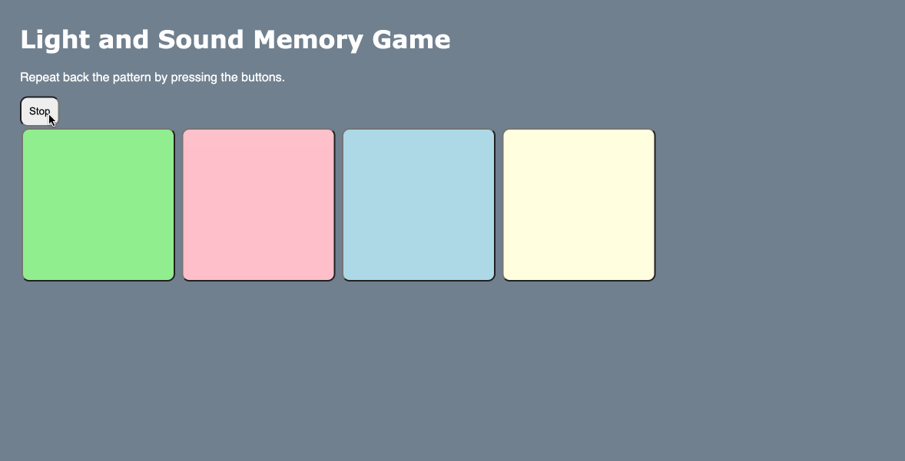

# Pre-work - *Memory Game*

**Memory Game** is a Light & Sound Memory game to apply for CodePath's SITE Program. 

Submitted by: **Abdullah Foysal**

Time spent: **2** hours spent in total

Link to project: https://swamp-striped-foxtrot.glitch.me/

## Required Functionality

The following **required** functionality is complete:

* [x] Game interface has a heading (h1 tag), a line of body text (p tag), and four buttons that match the demo app
* [x] "Start" button toggles between "Start" and "Stop" when clicked. 
* [x] Game buttons each light up and play a sound when clicked. 
* [x] Computer plays back sequence of clues including sound and visual cue for each button
* [x] Play progresses to the next turn (the user gets the next step in the pattern) after a correct guess. 
* [x] User wins the game after guessing a complete pattern
* [x] User loses the game after an incorrect guess

The following **optional** features are implemented:

* [ ] Any HTML page elements (including game buttons) has been styled differently than in the tutorial
* [ ] Buttons use a pitch (frequency) other than the ones in the tutorial
* [ ] More than 4 functional game buttons
* [x] Playback speeds up on each turn
* [ ] Computer picks a different pattern each time the game is played
* [ ] Player only loses after 3 mistakes (instead of on the first mistake)
* [ ] Game button appearance change goes beyond color (e.g. add an image)
* [ ] Game button sound is more complex than a single tone (e.g. an audio file, a chord, a sequence of multiple tones)
* [ ] User has a limited amount of time to enter their guess on each turn

## Video Walkthrough (GIF)

If you recorded multiple GIFs for all the implemented features, you can add them here:
![x]
![x]

## Reflection Questions
1. If you used any outside resources to help complete your submission (websites, books, people, etc) list them here. 
https://www.the-art-of-web.com/javascript/creating-sounds/

2. What was a challenge you encountered in creating this submission (be specific)? How did you overcome it? (recommended 200 - 400 words) 
A challenge encountered in creating this app was implementing the sound into the button presses. As opposed to simply copying and pasting it, most of the time spent was dedicated towards understanding how JavaScript acquires the values for the pitches and how it is applied in this app. In order to overcome this submission, I referred to the link provided by CodePath to navigate through the use of AudioContext. 

3. What questions about web development do you have after completing your submission? (recommended 100 - 300 words) 

Question 1. How does expanding one's website work in terms of gaining more audience and such? Would this push the developer into funneling money towards their project?

Question 2. What is the lifetime of a website based on? I have seen people having to buy monthly domain subscriptions for specific perks and such, but after a while, the website no longer exists. Can this all be done without being dependent on a domain?

Question 3. How does one incorporate security onto their website? From this submission, I have seen little to no details regarding encryption or some sort of web security, and I am wondering if implementing some sort of security will be gone over during this internship.

4. If you had a few more hours to work on this project, what would you spend them doing (for example: refactoring certain functions, adding additional features, etc). Be specific. (recommended 100 - 300 words) 
If I had a few more hours, I would've wanted to implement an additional visual. The visual would be a piano alongside the buttons, and the buttons themselves would be notes on any particular major or minor scale. These notes on the scale would be played at random, and it would be up to the player to repeat the pattern back. The idea would be to possibly train the player to associate the sounds with the notes on the piano. This would serve a similar function to the apps that are designed to help teach a person on how to play an intrument and different pieces of music through hands-on learning. 

## Interview Recording URL Link

[My 5-minute Interview Recording]https://www.loom.com/share/2731dcf18a204ade981523e47f915b5e

## License

    Copyright [Abdullah Foysal]

    Licensed under the Apache License, Version 2.0 (the "License");
    you may not use this file except in compliance with the License.
    You may obtain a copy of the License at

        http://www.apache.org/licenses/LICENSE-2.0

    Unless required by applicable law or agreed to in writing, software
    distributed under the License is distributed on an "AS IS" BASIS,
    WITHOUT WARRANTIES OR CONDITIONS OF ANY KIND, either express or implied.
    See the License for the specific language governing permissions and
    limitations under the License.
